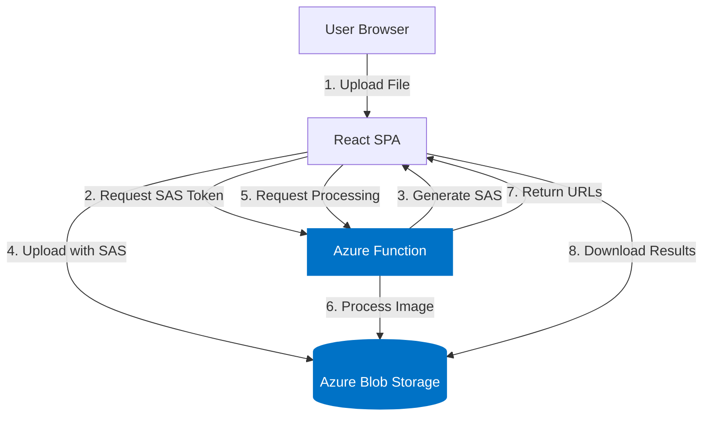
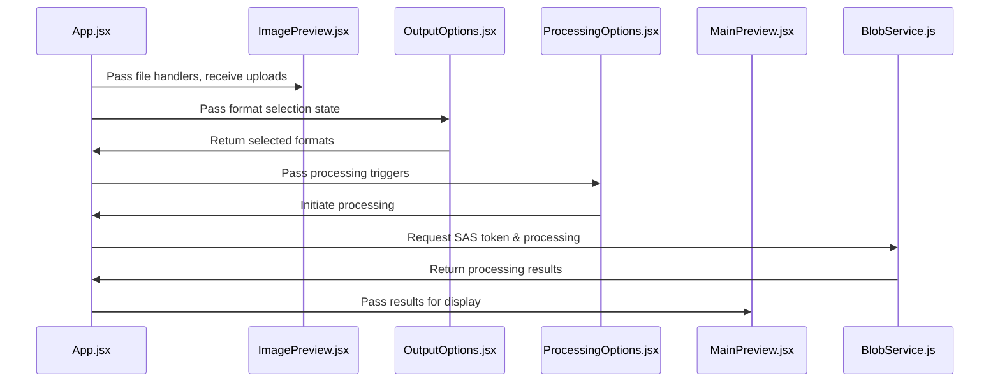

# Azure LogoCraft: Senior Developer Walkthrough

## Project Architecture Overview

The LogoCraft application represents a modern, cloud-native implementation of an image processing service built on Azure. At its core, this project demonstrates a clean separation of concerns with a React frontend hosted on Azure Static Web Apps, a serverless backend using Azure Functions, and Azure Blob Storage for file management.



What makes this architecture particularly elegant is its use of pattern I've come to call "minimized proxy data flow," where the backend generates secured, time-limited SAS tokens that allow the client to interact directly with storage, reducing backend bandwidth costs and improving scalability.

## Component Breakdown & Interactions

### Frontend Architecture

The React frontend follows a modern functional component architecture with hooks for state management. Let's analyze the key components:

#### Application Core (`App.jsx`)

The application core manages the entire state and workflow:

```javascript
// Key state elements with their purposes
const [currentFile, setCurrentFile] = useState(null);  // The uploaded file object
const [preview, setPreview] = useState(null);          // Data URL for image preview
const [selectedFormats, setSelectedFormats] = useState({...}); // Format selection state
const [isProcessing, setIsProcessing] = useState(false); // Processing indicator
const [activeStep, setActiveStep] = useState(1);       // Current workflow step
```

This centralized state approach allows for clean control flow through the three-step process (Upload → Configure → Download).

#### Component Interaction Flow



What's particularly well-designed here is how the parent component (`App.jsx`) serves as the state orchestrator, while child components focus on their specific responsibilities. This creates a clean unidirectional data flow that makes the application easier to understand and debug.

### Frontend Components In-Depth

#### `ImagePreview.jsx` - File Upload Handler

```javascript
// Key functional patterns in ImagePreview
const handleDragOver = (e) => e.preventDefault();
const handleDragEnter = (e) => {
  e.preventDefault();
  setIsDragging(true);  // Visual feedback for drag operation
};
const handleDrop = (e) => {
  e.preventDefault();
  setIsDragging(false);
  if (e.dataTransfer.files && e.dataTransfer.files[0]) {
    const file = e.dataTransfer.files[0];
    if (isImageFile(file)) {  // Type validation
      onFileSelect(file);     // Parent callback
    }
  }
};
```

**Developer Notes:**

- The component uses React's `useRef` to access the file input directly
- File type validation happens at both UI and server levels
- The drag-and-drop implementation follows established patterns with proper event handling

#### `BlobService.js` - Azure Integration Layer

This service encapsulates all Azure Storage interactions:

```javascript
// SAS token acquisition and direct upload pattern
export const uploadFileToBlob = async (file, desiredFilename) => {
  // 1. Get SAS token from backend
  const sasResponse = await fetch(`${API_BASE_URL}?action=getUploadSas&filename=${encodeURIComponent(desiredFilename)}`);
  const { uploadUrl, blobName } = await sasResponse.json();
  
  // 2. Direct upload to Blob Storage (bypassing backend for data transfer)
  await axios.put(uploadUrl, file, {
    headers: {
      'x-ms-blob-type': 'BlockBlob',
      'Content-Type': file.type
    }
  });
  
  return blobName;  // Return the blob identifier for later processing
};
```

**Developer Notes:**

- The service abstracts Azure-specific details from the UI components
- Error handling is implemented with proper try/catch blocks
- The API uses a consolidated endpoint with action parameters

### Backend Implementation

#### Consolidated Azure Function (`ProcessImage/index.js`)

The backend uses a single Azure Function with actions defined by query parameters:

```javascript
// Multi-action pattern with consolidated error handling
module.exports = async function (context, req) {
  const action = req.query.action;
  
  try {
    // Shared initialization
    const blobServiceClient = BlobServiceClient.fromConnectionString(storageConnectionString);

    if (action === 'getUploadSas') {
      // SAS token generation logic
    } else if (action === 'processImage') {
      // Image processing logic
    } else {
      // Invalid action handling
    }
  } catch (error) {
    // Consolidated error handling
    context.log.error(`Error: ${error.message}`, error.stack);
    context.res = {
      status: 500,
      body: { error: 'Failed to process request.', details: error.message }
    };
  }
};
```

This pattern consolidates related operations into a single function, reducing cold-start impacts and simplifying the API surface.

#### Image Processing Pipeline

```javascript
// Processing pipeline for each format
for (const formatKey of Object.keys(formats)) {
  if (formats[formatKey]) {
    const targetDimensions = getFormatDimensions(formatKey, context);
    
    // Process with Sharp transformations
    const processedBuffer = await sharp(imageBuffer)
      .resize({
        width: targetDimensions.width,
        height: targetDimensions.height,
        fit: 'contain',
        position: 'center',
        background: { r: 255, g: 255, b: 255, alpha: 1 }
      })
      .flatten({ background: { r: 255, g: 255, b: 255 } })
      .grayscale(formatKey.endsWith('.bmp'))  // Conditional processing
      .threshold(formatKey.endsWith('.bmp') ? 175 : 0)
      .png()
      .toBuffer();
      
    // Upload result to public container
    const outputBlobName = `${Date.now()}_${formatKey.replace(/[^a-zA-Z0-9.]/g, '_')}`;
    const outputBlobClient = outputContainerClient.getBlockBlobClient(outputBlobName);
    await outputBlobClient.uploadData(processedBuffer, {
      blobHTTPHeaders: { blobContentType: contentType }
    });
    
    // Store metadata for client
    processedImages.push({
      name: formatKey,
      url: outputBlobClient.url,  // Direct URL for client access
      size: `${targetDimensions.width}×${targetDimensions.height}`,
      dimensions: { width: targetDimensions.width, height: targetDimensions.height }
    });
  }
}
```

**Developer Notes:**

- The processing leverages Sharp's efficient image manipulation
- Format-specific processing rules are implemented through conditionals
- Results are stored with direct public URLs for client access
- Progress is tracked through the returned metadata

## Infrastructure Components

### Azure Resources (`main.bicep`)

The infrastructure is defined using Azure Bicep, with key components including:

```bicep
// Storage configuration with security settings
resource mainStorageAccount 'Microsoft.Storage/storageAccounts@2023-05-01' = {
  // Basic properties
  name: storageAccountName
  location: location
  kind: 'StorageV2'
  sku: { name: 'Standard_LRS' }
  
  // Security and access properties
  properties: {
    minimumTlsVersion: 'TLS1_2'
    allowBlobPublicAccess: true  // Required for downloads container
    allowSharedKeyAccess: true   // Required for connection string
    publicNetworkAccess: 'Enabled'
  }
}

// Container access policies
resource uploadsContainer '...@2023-05-01' = {
  // ... 
  properties: {
    publicAccess: 'None'  // Private, accessed via SAS
  }
}

resource downloadsContainer '...@2023-05-01' = {
  // ...
  properties: {
    publicAccess: 'Blob'  // Public read access
  }
}
```

**Developer Notes:**

- Storage settings balance security with accessibility requirements
- Container access policies follow the principle of least privilege
- The Static Web App is configured for integrated function hosting

## Debugging Guide

### Common Issues & Solutions

#### 1. SAS Token Issues

**Symptoms:** Upload fails with 403 Forbidden or token validation errors

**Debugging Steps:**

1. Check token expiration (default is 1 hour)
2. Verify permissions on the token (should include write, create, add)
3. Examine URL encoding, especially for special characters in filenames
4. Check for protocol mismatches (http vs https)

**Solution Example:**

```javascript
// Robust SAS URL generation with proper encoding
const blobName = encodeURIComponent(req.query.filename || `${Date.now()}-${Math.random().toString(36).substring(2, 15)}.tmp`);
// Ensure protocol matches client expectations
const sasUrl = await blobClient.generateSasUrl({
  // ...
  protocol: SASProtocol.Https  // Force HTTPS for production
});
```

#### 2. Image Processing Failures

**Symptoms:** Processing fails or produces unexpected results

**Debugging Steps:**

1. Check function logs for detailed error messages
2. Verify memory allocation (image processing is memory-intensive)
3. Examine input file format compatibility
4. Test individual Sharp transformations in isolation

**Solution Example:**

```javascript
// Add detailed logging throughout the pipeline
context.log(`Processing format: ${formatKey} (Target: ${targetDimensions.width}x${targetDimensions.height})`);
try {
  const processedBuffer = await sharp(imageBuffer)
    // ... transformations
    .toBuffer();
  context.log(`Processing successful, output size: ${processedBuffer.length} bytes`);
} catch (error) {
  context.log.error(`Sharp processing error: ${error.message}`, error);
  throw error;  // Re-throw for consolidated handling
}
```

#### 3. CORS Configuration Issues

**Symptoms:** API calls fail from frontend with CORS errors

**Debugging Steps:**

1. Check browser console for specific CORS error messages
2. Verify CORS configuration in Azure Static Web App settings
3. Ensure credentials handling is consistent

**Solution:**

- Configure CORS in Static Web App settings
- For direct blob access, ensure CORS is configured on Storage Account

## Modification Guide

### Adding a New Output Format

To add support for a new image format:

1. **Update format definition in frontend:**
    
    ```javascript
    // In App.jsx, add to selectedFormats state
    const [selectedFormats, setSelectedFormats] = useState({
      // Existing formats...
      'NewFormat.png': false,  // Add new format
    });
    
    // Add dimension definition
    const getFormatDimensions = (format) => {
      switch(format) {
        // Existing cases...
        case 'NewFormat.png': return { width: 400, height: 400 };
        default: return { width: 300, height: 300 };
      }
    };
    ```
    
2. **Add to UI categories:**
    
    ```javascript
    // In OutputOptions.jsx, add to appropriate group
    const formatGroups = [
      {
        title: "Category",
        formats: [
          // Existing formats...
          { 
            id: 'NewFormat.png', 
            label: 'New Format (400×400)', 
            tooltip: 'Description of new format'
          },
        ]
      },
    ];
    ```
    
3. **Update backend dimension mapping:**
    
    ```javascript
    // In ProcessImage/index.js
    function getFormatDimensions(format, context) {
      const dimensions = {
        // Existing formats...
        'NewFormat.png': { width: 400, height: 400 },
      };
      // ...
    }
    ```
    
4. **Add special processing if needed:**
    
    ```javascript
    // In ProcessImage/index.js processing pipeline
    let sharpInstance = sharp(imageBuffer)
      .resize({
        width: targetDimensions.width,
        height: targetDimensions.height,
        fit: 'contain',
        position: 'center',
        background: { r: 255, g: 255, b: 255, alpha: 1 }
      })
      .flatten({ background: { r: 255, g: 255, b: 255 } });
      
    // Add format-specific processing
    if (formatKey === 'NewFormat.png') {
      sharpInstance = sharpInstance.sharpen() // Example special processing
        .gamma(1.2);
    }
    ```
    

### Adding User Authentication

To add authentication to the application:

1. Configure Authentication in Azure Static Web App settings
2. Update the frontend to handle authentication state
3. Add restricted routes and user-specific storage

```javascript
// Authentication state in App.jsx
const [user, setUser] = useState(null);

// Fetch user info on mount
useEffect(() => {
  const fetchUser = async () => {
    try {
      const response = await fetch('/.auth/me');
      const userData = await response.json();
      setUser(userData?.clientPrincipal || null);
    } catch (error) {
      console.error('Failed to fetch user:', error);
    }
  };
  
  fetchUser();
}, []);

// Modify BlobService.js to include user context
export const processImage = async (sourceBlobName, formats, userId) => {
  return await fetch(`${API_BASE_URL}?action=processImage`, {
    method: 'POST',
    headers: { 'Content-Type': 'application/json' },
    body: JSON.stringify({ 
      sourceBlobName, 
      formats,
      userId  // Add user context for personalization
    }) 
  });
};
```

## Reusable Toolkit

### 1. Drag and Drop File Uploader

The `ImagePreview` component provides a full-featured file upload solution:

```jsx
// Reusable component definition
const FileUploader = ({ 
  onFileSelect,
  onRemoveFile, 
  preview = null,
  acceptedTypes = ['image/png', 'image/jpeg'],
  maxSize = 10 * 1024 * 1024,  // 10MB default
  showDimensions = true,
  showFileName = true,
}) => {
  const [isDragging, setIsDragging] = useState(false);
  const fileInputRef = useRef(null);
  
  // Implementation based on ImagePreview.jsx
  
  return (
    <div className={`uploader-container ${isDragging ? 'dragging' : ''}`}>
      {/* Component markup */}
    </div>
  );
};
```

**Usage Example:**

```jsx
<FileUploader
  onFileSelect={handleFileSelected}
  onRemoveFile={handleFileRemoved}
  preview={previewUrl}
  acceptedTypes={['image/png', 'image/jpeg', 'application/pdf']}
  maxSize={20 * 1024 * 1024}
  showDimensions={true}
/>
```

### 2. Multi-Step Process Indicator

The step indicator can be abstracted as a standalone component:

```jsx
// Reusable component definition
const StepIndicator = ({ 
  steps,             // Array of step objects: { number, title, optional }
  activeStep,        // Current active step number
  onStepClick = null // Optional callback for step navigation
}) => {
  return (
    <div className="steps-container">
      {steps.map((step) => {
        const isActive = activeStep === step.number;
        const isCompleted = activeStep > step.number;
        const isClickable = onStepClick && !step.optional;
        
        return (
          <div 
            className={`step-item ${isClickable ? 'clickable' : ''}`}
            key={step.number}
            onClick={() => isClickable && onStepClick(step.number)}
          >
            <div 
              className={`step-circle ${isActive ? 'active' : ''} ${isCompleted ? 'completed' : ''}`}
            >
              {isCompleted ? <CheckCircleFill size={20} /> : step.number}
            </div>
            <div className="step-title">{step.title}</div>
          </div>
        );
      })}
    </div>
  );
};
```

**Usage Example:**

```jsx
<StepIndicator
  activeStep={currentStep}
  steps={[
    { number: 1, title: "Input" },
    { number: 2, title: "Configure" },
    { number: 3, title: "Results" }
  ]}
  onStepClick={handleStepNavigation}
/>
```

### 3. Azure SAS Token Generator

The SAS token generation pattern can be extracted into a reusable utility:

```javascript
/**
 * Generates a SAS token for a blob
 * @param {BlobServiceClient} blobServiceClient - The initialized blob service client
 * @param {string} containerName - The container name
 * @param {string} blobName - The blob name
 * @param {object} options - Configuration options
 * @returns {Promise<string>} - The SAS URL
 */
async function generateBlobSasUrl(blobServiceClient, containerName, blobName, options = {}) {
  const {
    permissions = { read: false, write: true, create: true, add: true },
    expiryHours = 1,
    startDate = new Date(),
    protocol = 'https',
  } = options;
  
  // Ensure container exists
  const containerClient = blobServiceClient.getContainerClient(containerName);
  await containerClient.createIfNotExists();
  
  // Configure permissions
  const sasPermissions = new BlobSASPermissions();
  Object.entries(permissions).forEach(([perm, value]) => {
    if (value) sasPermissions[perm] = true;
  });
  
  // Set expiration
  const expiresOn = new Date(startDate);
  expiresOn.setHours(startDate.getHours() + expiryHours);
  
  // Generate URL
  const blobClient = containerClient.getBlobClient(blobName);
  return await blobClient.generateSasUrl({
    permissions: sasPermissions,
    startsOn: startDate,
    expiresOn: expiresOn,
    protocol: protocol === 'https' ? SASProtocol.Https : SASProtocol.HttpHttps
  });
}
```

**Usage Example:**

```javascript
// In your Azure Function
const sasUrl = await generateBlobSasUrl(
  blobServiceClient,
  'uploads',
  `user_${userId}/${fileName}`,
  { 
    expiryHours: 2,
    permissions: { write: true, create: true, add: true }
  }
);
```

### 4. Batch Processing Pattern

The image processing demonstrates a pattern applicable to any batch operation:

```javascript
/**
 * Processes items in batch with progress tracking
 * @param {Array} items - Items to process
 * @param {Function} processorFn - Async function to process each item
 * @param {Function} progressCallback - Progress notification callback
 * @param {Object} options - Additional options
 * @returns {Promise<Object>} - Processing results
 */
async function batchProcess(items, processorFn, progressCallback, options = {}) {
  const results = [];
  const total = items.length;
  let processed = 0;
  
  for (const item of items) {
    try {
      const result = await processorFn(item, options);
      results.push({
        item,
        success: true,
        result
      });
    } catch (error) {
      results.push({
        item,
        success: false,
        error: error.message
      });
    }
    
    processed++;
    if (progressCallback) {
      progressCallback({
        processed,
        total,
        percentComplete: Math.round((processed / total) * 100),
        currentItem: item
      });
    }
  }
  
  return {
    total,
    succeeded: results.filter(r => r.success).length,
    failed: results.filter(r => !r.success).length,
    results
  };
}
```

**Usage Example:**

```javascript
const processingResult = await batchProcess(
  Object.keys(formats).filter(f => formats[f]),
  async (formatKey) => {
    // Format-specific processing logic
    return processedItemMetadata;
  },
  (progress) => {
    // Update UI with progress
    setProgress(progress.percentComplete);
    setStatusMessage(`Processing ${progress.currentItem} (${progress.processed}/${progress.total})...`);
  }
);
```

## Performance Optimization Opportunities

### Frontend Optimizations

1. **Image Compression Before Upload**
    
    ```javascript
    // Client-side compression before upload
    const compressImage = async (file, maxSizeMB = 1) => {
      if (!file || file.type.indexOf('image/') !== 0) return file;
      
      const options = {
        maxSizeMB,
        maxWidthOrHeight: 2000,
        useWebWorker: true
      };
      
      try {
        // Using browser-image-compression library
        return await imageCompression(file, options);
      } catch (error) {
        console.warn('Image compression failed:', error);
        return file; // Fallback to original
      }
    };
    
    // Usage in upload handler
    const handleUpload = async (file) => {
      const compressedFile = await compressImage(file, 1);
      // Continue with upload...
    };
    ```
    
2. **React Memo for Stable Components**
    
    ```javascript
    // Optimize re-renders for stable components
    const FormatInfo = React.memo(({ formats }) => {
      // Component implementation
    });
    
    // Only re-render when props actually change
    export default React.memo(MainPreview, (prevProps, nextProps) => {
      return prevProps.preview === nextProps.preview &&
             prevProps.activeResult?.url === nextProps.activeResult?.url &&
             prevProps.isProcessing === nextProps.isProcessing;
    });
    ```
    

### Backend Optimizations

1. **Function Memory Allocation**
    
    Increase memory allocation for the function to improve image processing performance:
    
    ```powershell
    # PowerShell command to update function memory
    Set-AzFunctionAppSetting -Name "logocraftfunctions" -ResourceGroupName "LogoCraftRG" -AppSetting @{"FUNCTIONS_WORKER_PROCESS_MEMORY_LIMIT" = "4096"}
    ```
    
2. **Sharp Pipeline Optimization**
    
    ```javascript
    // Optimize Sharp pipeline for better performance
    const processImage = async (inputBuffer, format, dimensions) => {
      // Resize once to an intermediate size first for large images
      let pipeline = sharp(inputBuffer);
      
      // For very large images, use intermediate resize
      const metadata = await pipeline.metadata();
      if (metadata.width > 4000 || metadata.height > 4000) {
        pipeline = pipeline.resize(2000, 2000, { fit: 'inside' });
      }
      
      // Continue with format-specific processing
      return pipeline
        .resize(dimensions.width, dimensions.height, { fit: 'contain' })
        // Additional transformations...
        .toBuffer();
    };
    ```
    
3. **Blob Storage Tier Optimization**
    
    Configure lifecycle management for blob storage:
    
    ```powershell
    # PowerShell command to set lifecycle management
    $rule = New-AzStorageAccountManagementPolicyRule -Name "CleanupTempFiles" -PrefixMatch "uploads/" -BlobType "blockBlob" -BlockBlobAction Delete -BlobExpiryDays 1
    Set-AzStorageAccountManagementPolicy -ResourceGroupName "LogoCraftRG" -StorageAccountName "logocraftstorage" -Rule $rule
    ```
    

## Debugging & Monitoring Tips

### Effective Logging Strategy

The current implementation includes some logging, but you can enhance it with structured logging:

```javascript
// Structured logging pattern
function createLogger(context, operation) {
  return {
    info: (message, data = {}) => {
      context.log.info({
        operation,
        message,
        level: 'info',
        timestamp: new Date().toISOString(),
        ...data
      });
    },
    error: (message, error, data = {}) => {
      context.log.error({
        operation,
        message,
        level: 'error',
        timestamp: new Date().toISOString(),
        errorMessage: error.message,
        stack: error.stack,
        ...data
      });
    }
  };
}

// Usage
module.exports = async function (context, req) {
  const logger = createLogger(context, req.query.action || 'unknown');
  
  try {
    logger.info('Function started', { 
      query: req.query,
      headers: req.headers
    });
    
    // Function implementation
    
    logger.info('Function completed successfully', {
      processingTime: Date.now() - startTime,
      resultCount: processedImages.length
    });
  } catch (error) {
    logger.error('Function failed', error, {
      processingTime: Date.now() - startTime
    });
    throw error;
  }
};
```

### Local Development Setup

For effective local development, configure the following:

```powershell
# Create local settings file for Azure Functions
$localSettings = @{
  "IsEncrypted" = $false
  "Values" = @{
    "AzureWebJobsStorage" = "UseDevelopmentStorage=true"
    "AZURE_STORAGE_CONNECTION_STRING" = "UseDevelopmentStorage=true"
    "FUNCTIONS_WORKER_RUNTIME" = "node"
  }
}

$localSettings | ConvertTo-Json | Set-Content -Path "api/local.settings.json"

# Start Azurite for local storage emulation
npm install -g azurite
azurite --silent --location c:\azurite --debug c:\azurite\debug.log

# Start Azure Functions runtime
cd api
func start

# Start frontend development server
cd frontend
npm run dev
```

## Conclusion: Extending LogoCraft

The LogoCraft application provides a solid foundation that can be extended in several directions:

1. **Enhanced Image Processing**
    
    - Add image cropping and editing features
    - Implement image optimization options
    - Support for additional formats and conversions
2. **User Management & Personalization**
    
    - Add authentication and user profiles
    - Save frequent format configurations
    - Implement history of processed images
3. **Enterprise Integration**
    
    - Connect to content management systems
    - Implement webhook notifications
    - Add batch processing capabilities
4. **Performance & Scaling**
    
    - Implement CDN for processed image delivery
    - Add regional distribution for global performance
    - Implement caching strategies

The clean architecture and separation of concerns make this codebase an excellent foundation for building more complex image processing applications in Azure.

---

This walkthrough document should help you not only understand the LogoCraft project but also leverage its patterns and components in your future work. The code demonstrates many best practices for cloud-native application development that are applicable across a wide range of projects.