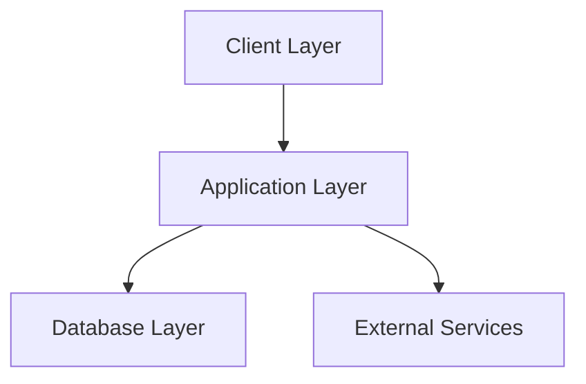
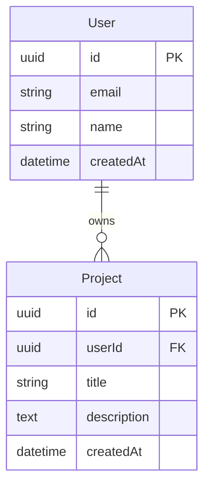
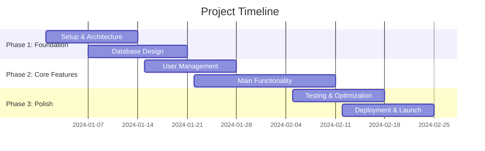
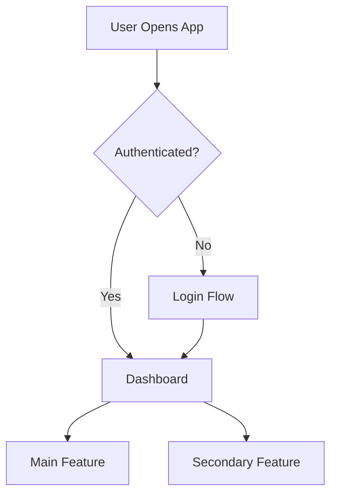

# Complete Guide: Creating Workspace Rules for Any Coding Project

## 🎯 **Core Methodology: The 5-Rule Framework**

Every coding project benefits from these 5 essential rule types:

1. **Architecture Rule** - Tech stack, constraints, infrastructure
2. **Data Rule** - Database schema, API design, data relationships
3. **Performance Rule** - Speed targets, optimization constraints
4. **Timeline Rule** - Project phases, dependencies, deadlines
5. **User Rule** - User flows, UX requirements, workflows

---

## 📋 **Step 1: Project Analysis & Documentation Creation**

### **Initial Project Assessment Questions:**

**Technical Foundation:**

- What's your tech stack? (Framework, database, hosting)
- What are your resource constraints? (Budget, performance, team size)
- What platforms do you need to support? (Web, mobile, desktop)

**Business Context:**

- Who are your users? (Roles, devices, workflows)
- What are your performance requirements? (Speed, scale, uptime)
- What's your timeline? (Launch date, milestones, dependencies)

**Complexity Level:**

- Simple (Single feature/component)
- Medium (Full application)
- Complex (Multi-service system)
- Enterprise (Multiple teams/systems)

### **Required Documentation Files:**

Create these files in `/docs/workspace-rules/`:

```
/docs/workspace-rules/
├── architecture.md      # Tech stack, constraints, infrastructure
├── data-schema.md      # Database/API design, relationships
├── performance.md      # Speed targets, optimization requirements
├── timeline.md         # Project phases, milestones, dependencies
├── user-flows.md       # User journeys, workflows, UX requirements
└── templates/
    ├── conversation-starters.md
    ├── feature-request.md
    └── troubleshooting.md
```

---

## 🏗️ **Step 2: Architecture Rule Creation**

### **What to Include:**

**Tech Stack Section:**

```markdown
## Technology Stack
- **Frontend:** [React/Vue/Angular + version]
- **Backend:** [Node.js/Python/Java + framework]
- **Database:** [PostgreSQL/MongoDB/MySQL + version]
- **Hosting:** [AWS/Azure/Vercel + specific services]
- **Key Libraries:** [List 5-10 most important dependencies]
```

**Constraints Section:**

```markdown
## Project Constraints
- **Budget:** $[amount]/month for infrastructure
- **Performance:** [Response time targets]
- **Scale:** [Expected users/traffic]
- **Platform Support:** [Web/Mobile/Desktop requirements]
- **Team Size:** [Number of developers]
```

**Infrastructure Diagram:**



### **Activation Mode:** `Always On`

**Why:** Architecture constraints affect every development decision

### **Example for Different Project Types:**

**Web App:**

```markdown
## Architecture Context
- **Framework:** Next.js 14 with TypeScript
- **Database:** PostgreSQL with Prisma ORM
- **Hosting:** Vercel (Frontend) + Railway (Database)
- **Budget:** $25/month total
- **Performance:** < 2s page loads, < 500ms API responses
```

**Mobile App:**

```markdown
## Architecture Context
- **Framework:** React Native 0.72
- **Backend:** Firebase/Supabase
- **Platforms:** iOS + Android
- **Performance:** < 1s screen transitions, offline-first
- **App Store:** Compliance with store guidelines
```

**API Service:**

```markdown
## Architecture Context
- **Framework:** Express.js + TypeScript
- **Database:** PostgreSQL with Redis cache
- **Hosting:** Docker on AWS ECS
- **Scale:** 1000 requests/minute
- **Security:** JWT auth, rate limiting, CORS
```

---

## 📊 **Step 3: Data Schema Rule Creation**

### **What to Include:**

**Entity Relationship Diagram:**



**API Design Patterns:**

```markdown
## API Conventions
- **RESTful endpoints:** /api/v1/[resource]
- **Error handling:** Standard HTTP codes + error objects
- **Pagination:** Cursor-based for performance
- **Authentication:** JWT tokens with refresh
```

### **Activation Mode:** `Model Decision`

**Description:** "Apply when discussing database operations, CRUD functionality, API endpoints, schema design, data relationships, or any work involving [your main entities]."

### **Trigger Keywords to Include:**

- Database, schema, table, relationship
- CRUD, API endpoint, query
- Your specific entity names
- ORM operations (Prisma, Sequelize, etc.)

---

## ⚡ **Step 4: Performance Rule Creation**

### **What to Include:**

**Performance Targets:**

```markdown
## Performance Requirements
- **Page Load:** < 2 seconds (3G connection)
- **API Response:** < 500ms (95th percentile)
- **Database Queries:** < 100ms average
- **Bundle Size:** < 1MB compressed
- **Lighthouse Score:** > 90 (Performance)
```

**Resource Constraints:**

```markdown
## Infrastructure Limits
- **Database:** [Connection limits, storage, compute]
- **CDN:** [Bandwidth limits, edge locations]
- **Server:** [Memory, CPU, concurrent connections]
- **Budget:** [Cost per month/user]
```

**Common Optimization Strategies:**

```markdown
## Optimization Checklist
- [ ] Database indexing strategy
- [ ] Caching layers (Redis, CDN)
- [ ] Image optimization
- [ ] Code splitting and lazy loading
- [ ] Database query optimization
```

### **Activation Mode:** `Model Decision`

**Description:** "Apply when discussing performance optimization, slow operations, [specific constraints], caching strategies, or any speed/efficiency concerns."

---

## 📅 **Step 5: Timeline Rule Creation**

### **What to Include:**

**Project Phases:**



**Dependencies & Critical Path:**

```markdown
## Critical Dependencies
- **Database setup** → Core feature development
- **Authentication system** → User-specific features
- **Payment integration** → Monetization features
- **Testing framework** → Quality assurance
```

### **Activation Mode:** `Manual`

**Why:** Timeline context only needed for planning discussions, not daily coding

---

## 👥 **Step 6: User Experience Rule Creation**

### **What to Include:**

**User Personas:**

```markdown
## Primary Users
- **Role:** [Primary user type]
- **Device:** [Mobile/Desktop/Tablet preferences]
- **Technical Level:** [Beginner/Intermediate/Advanced]
- **Key Goals:** [What they want to accomplish]
- **Pain Points:** [Current frustrations]
```

**User Journey Maps:**



**UX Requirements:**

```markdown
## UX Standards
- **Mobile-First:** Design for mobile, enhance for desktop
- **Accessibility:** WCAG 2.1 AA compliance
- **Touch Targets:** 44px minimum on mobile
- **Loading States:** Always show progress indicators
- **Error Handling:** Clear, actionable error messages
```

### **Activation Mode:** `Model Decision`

**Description:** "Apply when designing UI components, user interfaces, user experience flows, forms, or any frontend development involving user interactions."

---

## 🔧 **Step 7: Activation Mode Strategy**

### **Decision Matrix:**

|Rule Type|Always On|Model Decision|Manual|Use Case|
|---|---|---|---|---|
|**Architecture**|✅ Best|Possible|No|Universal constraints|
|**Data Schema**|Overwhelming|✅ Best|OK|CRUD operations|
|**Performance**|Overwhelming|✅ Best|OK|Optimization work|
|**Timeline**|Distracting|OK|✅ Best|Project planning|
|**User Experience**|Context-dependent|✅ Best|OK|UI development|

### **Project Size Considerations:**

**Small Projects (1-2 developers, <3 months):**

- Architecture: `Always On`
- Others: `Model Decision`

**Medium Projects (3-5 developers, 3-6 months):**

- Architecture: `Always On`
- Data + Performance: `Model Decision`
- Timeline: `Manual`
- UX: `Model Decision`

**Large Projects (5+ developers, 6+ months):**

- Consider multiple specialized rules
- Some rules might need `Always On`
- Team-specific rule sets

---

## 📝 **Step 8: Rule Content Templates**

### **Simple Project Template:**

```markdown
**Context:** @architecture.md
**Request:** [Specific development task]
**Constraints:** [Budget/Performance/Platform limitations]
**Output:** [Expected deliverable]
```

### **Feature Development Template:**

```markdown
**Architecture:** @architecture.md
**Data:** @data-schema.md
**UX:** @user-flows.md
**Request:** Build [specific feature]
**Requirements:** [Specific needs]
```

### **Performance Troubleshooting Template:**

```markdown
**System:** @architecture.md
**Performance Guide:** @performance.md
**Issue:** [Specific performance problem]
**Target:** [Performance goal]
```

---

## 🎯 **Step 9: Project-Type Specific Examples**

### **E-commerce Project Rules:**

**Architecture Focus:**

- Payment processing constraints
- Security requirements (PCI compliance)
- Inventory management systems
- Third-party integrations (Stripe, shipping APIs)

**Performance Focus:**

- Product search speed (< 500ms)
- Cart operations (< 200ms)
- Checkout flow optimization
- Image loading performance

**User Experience Focus:**

- Mobile shopping flow
- Accessibility for diverse users
- Multi-step checkout process
- Product discovery patterns

### **SaaS Application Rules:**

**Architecture Focus:**

- Multi-tenancy considerations
- Authentication & authorization
- Subscription management
- API rate limiting

**Data Focus:**

- Tenant data isolation
- Analytics and reporting
- User management hierarchies
- Feature flag systems

**Performance Focus:**

- Dashboard load times
- Real-time updates
- Data export performance
- API response times

### **Mobile App Rules:**

**Architecture Focus:**

- Platform-specific considerations (iOS/Android)
- Offline functionality
- Push notification systems
- App store compliance

**Performance Focus:**

- App startup time
- Battery usage optimization
- Network request efficiency
- Memory management

**User Experience Focus:**

- Touch interface design
- Platform-specific UX patterns
- Offline user experience
- Accessibility on mobile

---

## 🧪 **Step 10: Testing & Optimization**

### **Rule Effectiveness Testing:**

**Week 1: Baseline Testing**

- Track conversation length without rules
- Note how often you repeat context
- Measure time spent explaining constraints

**Week 2: Rules Implementation**

- Test each activation mode
- Monitor AI response quality
- Track character usage per conversation

**Week 3: Optimization**

- Refine trigger keywords
- Adjust activation modes if needed
- Update rule content based on usage

### **Success Metrics:**

**Efficiency Gains:**

- [ ] 80%+ reduction in context-setting time
- [ ] Fewer clarification questions from AI
- [ ] More accurate first responses
- [ ] Consistent consideration of constraints

**Quality Improvements:**

- [ ] AI suggestions align with architecture
- [ ] Performance considerations automatic
- [ ] User experience patterns followed
- [ ] Timeline awareness in planning

---

## 🚀 **Quick Start Checklist**

### **For Any New Project:**

**Day 1: Analysis**

- [ ] Complete project assessment questions
- [ ] Identify 3-5 main constraints
- [ ] List primary user types and workflows

**Day 2: Documentation**

- [ ] Create architecture.md with tech stack + constraints
- [ ] Create basic user-flows.md with main journeys
- [ ] Draft performance.md with speed targets

**Day 3: Rules Setup**

- [ ] Create Architecture rule (Always On)
- [ ] Create UX rule (Model Decision)
- [ ] Test with simple development questions

**Day 4: Expansion**

- [ ] Add data schema rule if database-heavy
- [ ] Add performance rule if optimization-critical
- [ ] Add timeline rule for project management

**Day 5: Optimization**

- [ ] Test all activation modes
- [ ] Refine trigger descriptions
- [ ] Document rule usage patterns

---

## 💡 **Advanced Techniques**

### **Rule Inheritance:**

Create base rules for common patterns across projects:

- `base-web-app.md` - Common web application patterns
- `base-api.md` - Standard API development practices
- `base-mobile.md` - Mobile development considerations

### **Team Rules:**

For multi-developer teams:

- `team-coding-standards.md` - Shared coding conventions
- `team-review-checklist.md` - Code review requirements
- `team-deployment.md` - Deployment and DevOps practices

### **Industry-Specific Rules:**

- `healthcare-compliance.md` - HIPAA, medical device standards
- `finance-security.md` - PCI DSS, financial regulations
- `education-accessibility.md` - ADA compliance, student privacy

---

## 🎯 **Success Patterns from Real Projects**

### **What Works:**

✅ **Architecture Always On** - Universal constraints always matter  
✅ **Specific Entity Names** - Include your actual table/model names  
✅ **Measurable Targets** - "< 2 seconds" vs "fast"  
✅ **Platform Specifics** - iOS vs Android, mobile vs desktop  
✅ **Budget Constraints** - Concrete dollar amounts and limits

### **What Doesn't Work:**

❌ **Too Many Always On Rules** - Overwhelming context  
❌ **Vague Descriptions** - "Apply for frontend work"  
❌ **Missing Trigger Words** - AI can't detect relevance  
❌ **Outdated Content** - Rules become stale over time  
❌ **Generic Templates** - One-size-fits-all rarely works

---

This methodology transforms your development workflow with any AI coding assistant, ensuring consistent, context-aware assistance that understands your project's unique constraints and requirements.