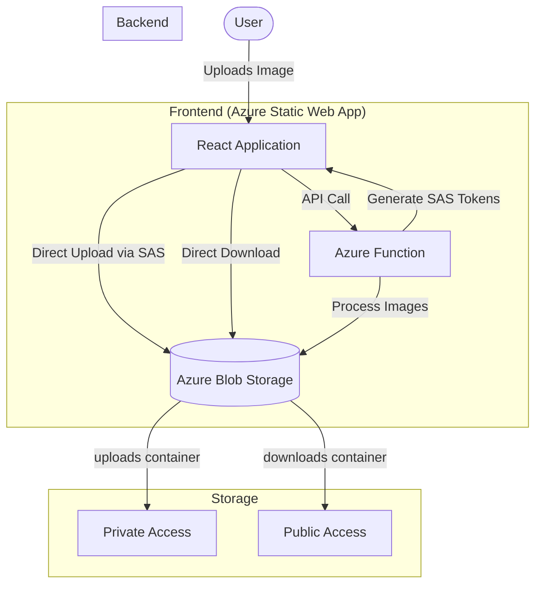
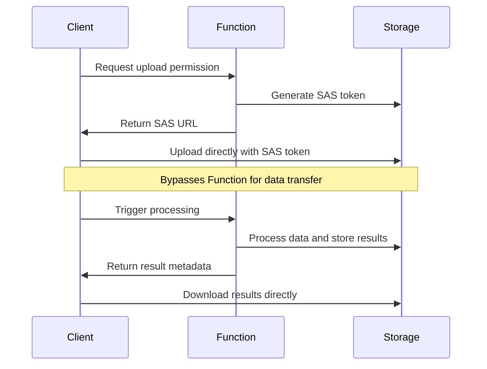
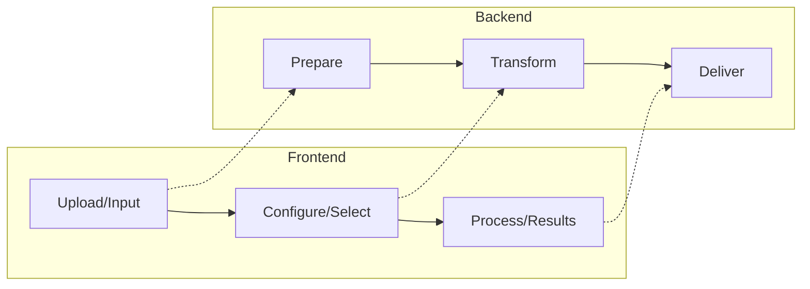
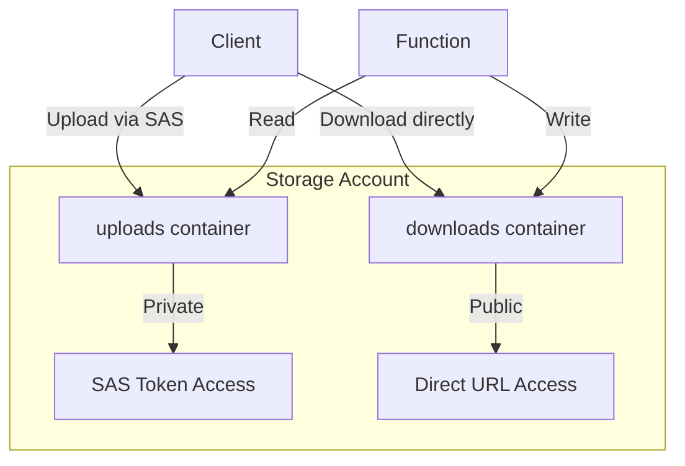

# Azure LogoCraft Project: Developer Reference & Reuse Guide

## 📚 Introduction

The Azure LogoCraft project represents a modern cloud-based image processing application with a clean architecture that leverages Azure's serverless capabilities. This document serves two purposes:

1. **Developer Reference Manual**: A comprehensive guide to understanding each component
2. **Reusability Guide**: Identification of patterns, modules, and logic you can extract for future projects

This guide balances technical depth with practical insights based on real-world implementation patterns.



## 🔍 Part I: Developer Reference Manual

### Frontend Architecture

#### Core Application Structure

The frontend follows a modern React pattern with functional components and hooks. The application state is centralized in `App.jsx`, which orchestrates the complete workflow.

```javascript
// Key state elements in App.jsx
const [currentFile, setCurrentFile] = useState(null);
const [preview, setPreview] = useState(null);
const [selectedFormats, setSelectedFormats] = useState({...});
const [isProcessing, setIsProcessing] = useState(false);
const [activeStep, setActiveStep] = useState(1);
```

**Three-Step Process Flow**:

1. **Upload** (Step 1): Image selection and preview
2. **Configure** (Step 2): Format selection and options
3. **Process & Download** (Step 3): Processing and results delivery

#### Component Breakdown

##### 1. `ImagePreview.jsx` - File Upload Component

This component handles all aspects of image input, including:

```javascript
// Key features of ImagePreview
const handleDrop = (e) => {
  e.preventDefault();
  setIsDragging(false);
  if (e.dataTransfer.files && e.dataTransfer.files[0]) {
    const file = e.dataTransfer.files[0];
    if (isImageFile(file)) {
      onFileSelect(file);
    }
  }
};
```

**Usage Notes**:

- Implements drag-and-drop with visual feedback
- Handles file type validation
- Displays image preview with dimension information
- Uses refs for direct file input access

##### 2. `OutputOptions.jsx` - Format Selection UI

This component organizes available export formats into logical groups:

```javascript
// Format grouping structure
const formatGroups = [
  {
    title: "Installer Images",
    formats: [
      { id: 'Logo.png', label: 'Logo PNG (300×300)', tooltip: '...' },
      // Additional formats...
    ]
  },
  // More groups...
];
```

**Usage Notes**:

- Tab-based organization for format categories
- Batch selection functionality
- Tooltips for format information
- Responsive grid layout for options

##### 3. `MainPreview.jsx` - Adaptive Display Component

This component adapts its display based on the current application state:

```javascript
// Conditional rendering based on state
const renderPreviewContent = () => {
  if (isProcessing && activeStep !== 3) {
    return (
      <div className="processing-animation">
        <div className="spinner"></div>
        <h4>Processing your image...</h4>
        <p>This may take a few moments</p>
      </div>
    );
  }
  
  if (activeResult) {
    // Show processed image
  }
  
  if (preview) {
    // Show original image preview
  }
  
  // Default empty state
};
```

**Usage Notes**:

- Context-aware rendering based on multiple state factors
- Processing animation during active operations
- Results display with download options
- Empty state handling

##### 4. `StepIndicator.jsx` - Workflow Visualization

This component provides visual progress indication:

```javascript
// Step rendering with state awareness
{steps.map((step) => {
  const isActive = activeStep === step.number;
  const isCompleted = activeStep > step.number;
  
  return (
    <div className="step-item" key={step.number}>
      <div className={`step-circle ${isActive ? 'active' : ''} ${isCompleted ? 'completed' : ''}`}>
        {isCompleted ? <CheckCircleFill size={20} /> : step.number}
      </div>
      <div className="step-title">{step.title}</div>
    </div>
  );
})}
```

**Usage Notes**:

- Visual connection lines between steps
- State-based styling (active, completed)
- Icon transitions on completion

#### Service Integration

##### `BlobService.js` - Azure Storage Integration

This service handles all interactions with Azure Blob Storage:

```javascript
// SAS token acquisition and upload
export const uploadFileToBlob = async (file, desiredFilename) => {
  try {
    // Request SAS URL from function
    const sasResponse = await fetch(`${API_BASE_URL}?action=getUploadSas&filename=${encodeURIComponent(desiredFilename)}`);
    
    const { uploadUrl, blobName } = await sasResponse.json();
    
    // Upload directly to Blob Storage
    await axios.put(uploadUrl, file, {
      headers: {
        'x-ms-blob-type': 'BlockBlob',
        'Content-Type': file.type
      },
      onUploadProgress: (progressEvent) => {
        // Progress tracking
      }
    });

    return blobName;
  } catch (error) {
    throw error;
  }
};
```

**Usage Notes**:

- Abstracts all Azure Storage interactions
- Handles SAS token acquisition
- Provides direct upload to blob storage
- Processes image through Azure Function
- Retrieves processed image data for download

### Backend Implementation

#### Consolidated Azure Function (`ProcessImage/index.js`)

The backend uses a single Azure Function with multiple responsibilities:

```javascript
module.exports = async function (context, req) {
  const action = req.query.action;
  
  try {
    const blobServiceClient = BlobServiceClient.fromConnectionString(storageConnectionString);

    if (action === 'getUploadSas') {
      // Generate SAS token for upload
    } else if (action === 'processImage') {
      // Process image according to selected formats
    } else {
      // Handle invalid action
    }
  } catch (error) {
    // Error handling
  }
};
```

##### SAS Token Generation

```javascript
// SAS token generation logic
const permissions = new BlobSASPermissions();
permissions.write = true;
permissions.create = true;
permissions.add = true;

const startsOn = new Date();
const expiresOn = new Date(startsOn);
expiresOn.setHours(startsOn.getHours() + 1); // 1 hour validity

const blobClient = containerClient.getBlobClient(blobName);
const sasUrl = await blobClient.generateSasUrl({
  permissions: permissions,
  startsOn: startsOn,
  expiresOn: expiresOn,
  protocol: SASProtocol.HttpHttps
});
```

##### Image Processing Pipeline

```javascript
// Image processing logic
for (const formatKey of Object.keys(formats)) {
  if (formats[formatKey]) {
    const targetDimensions = getFormatDimensions(formatKey, context);
    
    const processedBuffer = await sharp(imageBuffer)
      .resize({
        width: targetDimensions.width,
        height: targetDimensions.height,
        fit: 'contain',
        position: 'center',
        background: { r: 255, g: 255, b: 255, alpha: 1 }
      })
      .flatten({ background: { r: 255, g: 255, b: 255 } })
      .grayscale(formatKey.endsWith('.bmp'))
      .threshold(formatKey.endsWith('.bmp') ? 175 : 0)
      .png()
      .toBuffer();
      
    // Upload processed image to downloads container
  }
}
```

**Usage Notes**:

- Consolidates multiple operations in one function
- Uses action parameter to determine behavior
- Implements secure SAS token generation
- Processes images with Sharp library
- Format-specific processing rules

### Infrastructure Configuration

#### Azure Resources (`main.bicep`)

The infrastructure is defined using Azure Bicep, Microsoft's domain-specific language for Azure resource deployment:

```bicep
// Storage Account configuration
resource mainStorageAccount 'Microsoft.Storage/storageAccounts@2023-05-01' = {
  name: storageAccountName
  location: location
  kind: 'StorageV2'
  sku: {
    name: 'Standard_LRS'
  }
  properties: {
    minimumTlsVersion: 'TLS1_2'
    allowBlobPublicAccess: true // Required for downloads container
    allowSharedKeyAccess: true  // Required for connection string
    publicNetworkAccess: 'Enabled'
  }
}

// Container configuration
resource uploadsContainer 'Microsoft.Storage/storageAccounts/blobServices/containers@2023-05-01' = {
  parent: blobService
  name: 'uploads'
  properties: {
    publicAccess: 'None' // Private, accessed via SAS
  }
}

resource downloadsContainer 'Microsoft.Storage/storageAccounts/blobServices/containers@2023-05-01' = {
  parent: blobService
  name: 'downloads'
  properties: {
    publicAccess: 'Blob' // Public read access for blobs
  }
}
```

**Usage Notes**:

- Defines all required Azure resources
- Configures correct access levels for containers
- Sets up Static Web App with integrated function
- Injects necessary application settings

## 🔄 Part II: Reusability Guide

### Reusable UI Components

#### 1. Drag and Drop File Uploader

The `ImagePreview` component provides a complete file upload solution you can extract for any project:

```jsx
// Reusable file upload component
const FileUploader = ({ 
  onFileSelect, 
  preview,
  onRemoveFile,
  acceptedTypes = ['image/png', 'image/jpeg', 'image/gif'],
  maxSize = 20 * 1024 * 1024, // 20MB default
  showDimensions = true
}) => {
  // Implementation based on ImagePreview.jsx
};
```

**How to Reuse**:

1. Extract the component with generalized props
2. Customize accepted file types and validation
3. Implement your own file handling logic
4. Style according to your application theme

#### 2. Multi-Step Process Indicator

The step indicator can be abstracted into a reusable component for any multi-step process:

```jsx
// Reusable step indicator
const ProcessSteps = ({ 
  steps, // Array of step objects with number, title
  activeStep, // Current active step number
  onStepClick = null // Optional step navigation callback
}) => {
  // Implementation based on StepIndicator.jsx
};
```

**How to Reuse**:

1. Extract with customizable step definitions
2. Add optional step navigation
3. Customize appearance for your application
4. Integrate with your process flow

#### 3. Panel-Based UI System

The panel-based layout system offers a consistent UI pattern:

```jsx
// Reusable panel component
const Panel = ({
  title,
  subtitle,
  children,
  isActive = false,
  badge = null,
  icon = null,
  className = ''
}) => {
  // Implementation based on panel structure in App.jsx
};
```

**How to Reuse**:

1. Extract panel styling and structure
2. Implement as a container component
3. Add active/inactive state styling
4. Use for consistent section layouts

### Reusable Backend Patterns

#### 1. Consolidated Function with Action Parameter

Rather than creating multiple endpoints, use a single function with an action parameter:

```javascript
// Multi-action function pattern
module.exports = async function(context, req) {
  const action = req.query.action;
  
  switch(action) {
    case 'action1':
      return handleAction1(req, context);
    case 'action2':
      return handleAction2(req, context);
    default:
      return {
        status: 400,
        body: { error: "Invalid action specified" }
      };
  }
};
```

**Benefits**:

- Simplified API surface area
- Shared initialization and error handling
- Easier deployment and monitoring
- Consolidated permissions

#### 2. SAS Token Generation Pattern

The SAS token generation pattern can be reused for secure, temporary storage access:

```javascript
// Reusable SAS token generator
async function generateSasToken(blobServiceClient, containerName, blobName, permissions, expiryHours = 1) {
  const containerClient = blobServiceClient.getContainerClient(containerName);
  await containerClient.createIfNotExists();
  
  const sasPermissions = new BlobSASPermissions();
  // Set permissions based on input
  
  const startsOn = new Date();
  const expiresOn = new Date(startsOn);
  expiresOn.setHours(startsOn.getHours() + expiryHours);
  
  const blobClient = containerClient.getBlobClient(blobName);
  return await blobClient.generateSasUrl({
    permissions: sasPermissions,
    startsOn,
    expiresOn,
    protocol: SASProtocol.Https
  });
}
```

**How to Reuse**:

1. Abstract into a utility function
2. Customize permissions based on needs
3. Adjust expiration timeframes
4. Use for temporary client access to private blobs

#### 3. Batch Processing Pipeline

The image processing pipeline demonstrates a pattern for batch operations:

```javascript
// Reusable batch processing pattern
async function batchProcess(items, processingFunction, options = {}) {
  const results = [];
  
  for (const item of items) {
    try {
      const result = await processingFunction(item, options);
      results.push({
        item,
        success: true,
        result
      });
    } catch (error) {
      results.push({
        item,
        success: false,
        error: error.message
      });
    }
  }
  
  return {
    processed: results.length,
    succeeded: results.filter(r => r.success).length,
    failed: results.filter(r => !r.success).length,
    results
  };
}
```

**How to Reuse**:

1. Abstract into a utility function
2. Use for any parallel/sequential processing
3. Add progress tracking
4. Implement result aggregation

### Architectural Patterns

#### 1. Client-Direct Storage Access Pattern

This pattern allows clients to interact directly with storage while maintaining security:



**Implementation Strategy**:

1. Backend generates short-lived, limited-permission SAS tokens
2. Client uploads directly to storage using token
3. Client triggers processing by sending blob reference
4. Results stored with appropriate access (private/public)

**Benefits**:

- Reduced backend bandwidth costs
- Improved scalability
- Better performance for large files
- Simplified backend implementation

#### 2. Three-Tier Processing Pattern

This pattern separates the processing workflow into clear stages:



**Implementation Strategy**:

1. Split frontend into distinct steps with state transitions
2. Backend handles each process phase independently
3. Clear visual indication of current status
4. Proper state reset/recovery between operations

**Benefits**:

- Improved user experience
- Clear separation of concerns
- Easier error recovery
- Progressive disclosure of options

#### 3. Public/Private Container Pattern

This pattern uses different access policies for input vs. output data:



**Implementation Strategy**:

1. Private container for uploads (SAS access only)
2. Public container for processed results
3. Backend access to both containers
4. Client direct access to public container

**Benefits**:

- Improved security for source files
- Better performance for downloads
- Simplified client implementation
- Clear separation of concerns

## 💡 Key Implementation Insights

### 1. Frontend State Management

The project uses React's useState hooks effectively for a centralized state management approach:

```javascript
// State variables in App.jsx
const [currentFile, setCurrentFile] = useState(null);
const [preview, setPreview] = useState(null);
const [selectedFormats, setSelectedFormats] = useState({...});
const [isProcessing, setIsProcessing] = useState(false);
const [progress, setProgress] = useState(0);
const [activeStep, setActiveStep] = useState(1);
```

**Implementation Insights**:

- Centralized state in parent component
- Props passing for child components
- Clear state transitions between steps
- Using state to control UI appearance

### 2. Error Handling Strategy

The project implements comprehensive error handling:

```javascript
// Frontend error handling
try {
  // Operation
} catch (err) {
  console.error('Processing error:', err);
  const errorMsg = err.message || 'An error occurred';
  setError(`Operation failed: ${errorMsg}`);
  setStatusMessage(`Error: ${errorMsg}`);
  setActiveStep(2); // Return to configuration step
}

// Backend error handling
try {
  // Operation
} catch (error) {
  context.log.error(`Error: ${error.message}`, error.stack);
  context.res = {
    status: 500,
    body: { error: 'Failed to process request.', details: error.message }
  };
}
```

**Implementation Insights**:

- Detailed error logging
- User-friendly error messages
- State recovery after errors
- Contextual error handling

### 3. Progressive Enhancement

The application implements progressive enhancement through adaptive UI:

- Starts with core upload functionality
- Expands options based on uploaded content
- Provides detailed results as they become available
- Graceful handling of limited capabilities

## 🛠️ Development Tips & Best Practices

### Local Development Setup

To effectively work with this codebase:

1. **Azure Function Development**:
    
    - Install Azure Functions Core Tools
    - Create `local.settings.json` with necessary connection strings
    - Use Azurite for local storage emulation
2. **Frontend Development**:
    
    - Run with `npm run dev` in the frontend directory
    - Configure Vite for API proxying to local Function
    - Use browser developer tools for state debugging
3. **Infrastructure Testing**:
    
    - Set up a test resource group
    - Use Azure CLI or PowerShell for resource inspection
    - Review deployment logs for troubleshooting

### Common Issues & Solutions

1. **CORS Issues**:
    
    - Ensure CORS is properly configured in Azure
    - Check for protocol mismatches (http/https)
    - Verify correct origins in CORS settings
2. **SAS Token Problems**:
    
    - Check token expiration times
    - Verify permissions on tokens
    - Ensure proper URL encoding of filenames
3. **Image Processing Errors**:
    
    - Check for memory limits in Function settings
    - Verify Sharp library installation and dependencies
    - Add detailed logging for troubleshooting

## 📊 Performance Considerations

### Optimization Opportunities

1. **Frontend Optimizations**:
    
    - Implement lazy loading for components
    - Add image compression before upload
    - Optimize React component rendering
2. **Backend Optimizations**:
    
    - Adjust Function memory allocation
    - Implement caching for frequent operations
    - Optimize image processing parameters
3. **Infrastructure Optimizations**:
    
    - Add CDN for processed images
    - Implement automatic scaling rules
    - Configure storage lifecycle policies

## 🔍 Conclusion: Evolution Pathways

This project establishes a solid foundation that can evolve in several directions:

1. **Authentication & User Management**:
    
    - Add user authentication for personalized experiences
    - Implement saved configurations
    - Add history of processed images
2. **Advanced Processing Features**:
    
    - Expand format options
    - Add image editing capabilities
    - Implement batch processing for multiple images
3. **Enterprise Integration**:
    
    - Add integration with design systems
    - Implement workflow automation
    - Connect to asset management systems

The modular architecture and clean separation of concerns make this project an excellent starting point for more complex image processing applications or as a template for other Azure-based web applications.