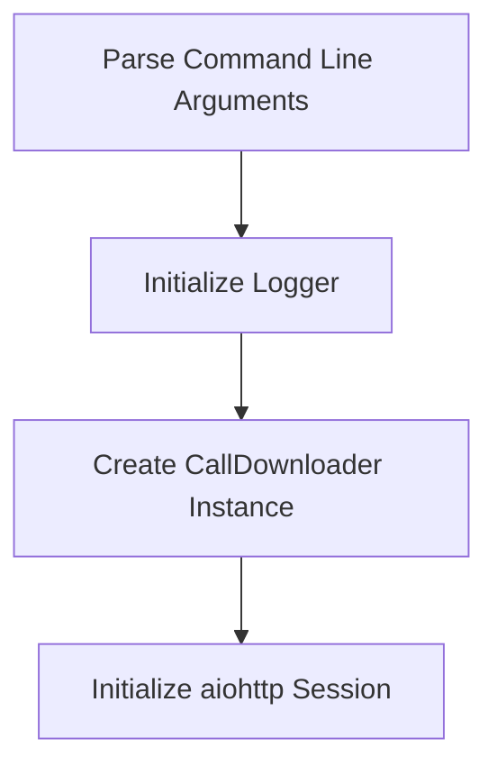
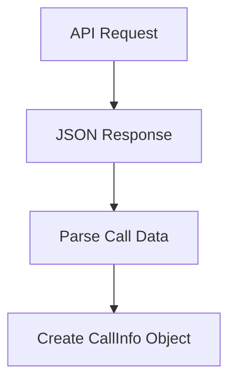
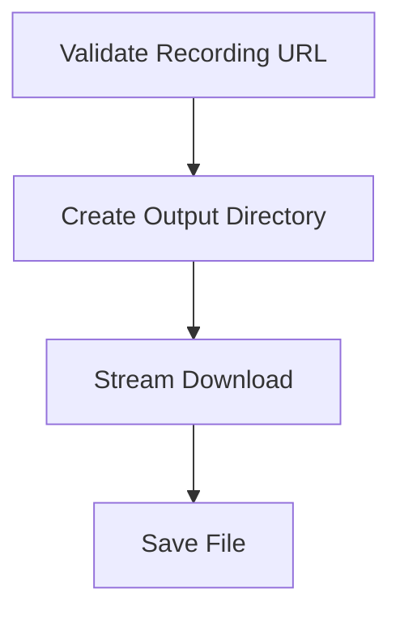

# CHAT Call Audio Download System Technical Documentation

  

## System Overview

This system implements an asynchronous audio file downloader for the telephony API, handling both call metadata retrieval and audio file downloads with progress tracking and error handling.

  

## Order of Operations

  

### 1. Script Initialization



  

### 2. Call Data Retrieval



  

### 3. Audio Download



  

## File Structure and Components

  

### 1. Main Script (`R:\Projects\Python\CHAT_APP\test_processing\download_calls.py`)

Primary execution script that orchestrates the download process.

  

#### Key Components

- **CallInfo Dataclass**

  ```python

  @dataclass

  class CallInfo:

      store_name: str = ""

      agent_name: str = ""

      call_status: str = ""

      call_in_time: str = ""

      call_out_time: str = ""

      recording_url: str = ""

      call_sid: str = ""

  ```

  Purpose: Structured storage of call metadata

  

- **CallDownloader Class**

  - **__init__**

    ```python

    def __init__(self, base_url: str = "https://telephony.ordrai.com/calls")

    ```

    Purpose: Initialize download client with API endpoint

  

  - **get_call_info**

    ```python

    async def get_call_info(self, order_id: str) -> CallInfo

    ```

    Purpose: Retrieve call metadata from API

    - Input: OrderID string

    - Output: CallInfo object containing call details

    - Error Handling: Retries on network failures

  

  - **download_audio**

    ```python

    async def download_audio(

        self,

        order_id: str,

        output_dir: str,

        info: Optional[CallInfo] = None

    ) -> Tuple[str, int]

    ```

    Purpose: Download MP3 file for specified call

    - Input:

      - OrderID

      - Output directory

      - Optional CallInfo object

    - Output: Tuple of (file_path, file_size)

    - Features:

      - Progress tracking

      - Chunk-based downloading

      - Automatic cleanup on failure

  

### 2. Output Directory (`R:\Projects\Python\CHAT_APP\test_processing\downloads\`)

Default location for downloaded audio files.

- Structure: `OrderID.mp3` naming convention

- Created automatically if not present

  

## Execution Flow

  

1. **Command Line Processing**

   ```bash

   python download_calls.py E8ZQCJ

   ```

   - Parses arguments using argparse

   - Validates input parameters

   - Sets up logging configuration

  

2. **API Connection**

   - Initializes aiohttp client session

   - Configures timeout settings (300s total, 30s connect, 60s read)

   - Sets up automatic retry mechanism with backoff

  

3. **Call Data Retrieval**

   - Sends GET request to API endpoint

   - Processes JSON response

   - Extracts recording URL and metadata

   - Creates CallInfo instance

  

4. **Audio Download**

   - Creates output directory if needed

   - Initiates streaming download

   - Shows progress in real-time

   - Handles errors and cleanup

   - Returns file information

  

5. **Cleanup and Exit**

   - Closes aiohttp session

   - Removes partial downloads on failure

   - Returns appropriate exit code

  

## Error Handling

  

1. **Network Errors**

   - Automatic retry with exponential backoff

   - Maximum 3 retry attempts

   - Detailed error logging

  

2. **File System Errors**

   - Automatic directory creation

   - Cleanup of partial downloads

   - Permission error handling

  

3. **API Errors**

   - 404: Order not found

   - 429: Rate limit handling

   - Generic HTTP error handling

  

## Dependencies

  

Required Python packages:

```plaintext

aiohttp>=3.7.4

backoff>=1.10.0

```

  

## Output Format

  

1. **Call Information Display**

   ```plaintext

   Call Information:

   Order ID: E8ZQCJ

   Store: MI-062 Jet's 15235 E Seven Mile 313-839-4800

   Agent: Jorina Blanche

   Status: AGENT_MONITOR_REDIRECT

   Call In Time: 2025-02-20T22:52:34.000Z

   Call Out Time: 2025-02-20T22:56:46.000Z

   Recording URL Available: Yes

   ```

  

2. **Download Progress**

   ```plaintext

   Downloading audio file...

   Download progress: 45.2%

   ```

  

3. **Completion Status**

   ```plaintext

   Download completed:

   File: downloads/E8ZQCJ.mp3

   Size: 2.45 MB

   ```

  

## Usage Examples

  

1. **Basic Download**

   ```bash

   python download_calls.py E8ZQCJ

   ```

  

2. **Custom Output Directory**

   ```bash

   python download_calls.py E8ZQCJ --output-dir "C:\MyDownloads"

   ```

  

## Performance Considerations

  

1. **Memory Usage**

   - Streaming download implementation

   - 1MB chunk size for optimal memory usage

   - Automatic cleanup of temporary resources

  

2. **Network Optimization**

   - Session reuse for multiple downloads

   - Configurable timeout settings

   - Automatic retry with backoff

  

3. **Disk I/O**

   - Buffered writing using chunks

   - Sequential file writing

   - Atomic file operations for safety