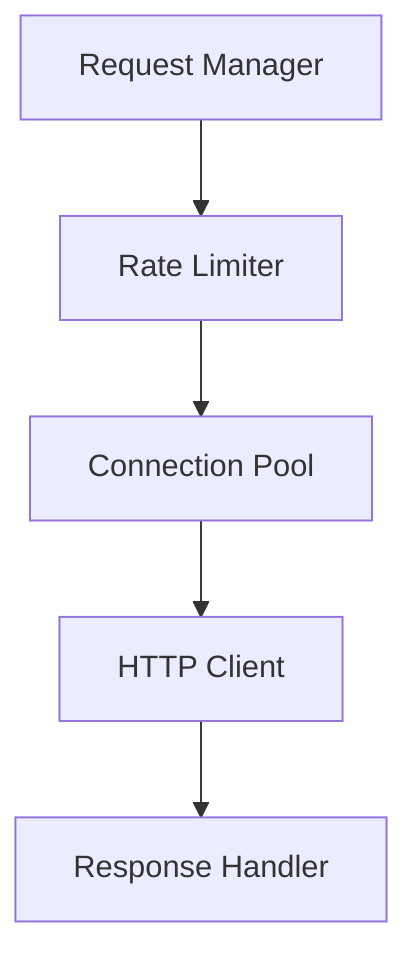

Let me explain how we handle project documentation differently depending on whether it's an artifact or regular documentation. This distinction is important for maintaining effective project knowledge management.

Regular Documentation Treatment:
When we create regular documentation, it lives directly in our project repository as markdown files or within our code as comments. This documentation is meant to be read as part of the natural flow of working with the project. For example, our git workflow guide might look like this:

```markdown
# Git Workflow Guide

Our team follows a trunk-based development approach with short-lived feature branches. This guide explains our standard procedures for managing code changes.

When starting new work:
1. Create a feature branch from main
2. Make small, focused commits
3. Push changes daily
4. Create pull requests early for feedback
```

This documentation is:
- Immediately accessible in the repository
- Read sequentially as part of normal workflows
- Updated directly through regular commits
- Formatted simply with basic markdown
- Integrated into the development process

Artifact Treatment:
When we create artifacts, they require special handling and structure. For example, our system architecture documentation might become an artifact because it contains complex diagrams, detailed specifications, and needs to be referenced independently. Here's how we would handle it:


# System Architecture Documentation

## Overview
The Web Analytics Framework consists of four primary subsystems working in concert to collect, process, store, and analyze web data. This document details the complete system architecture, including all components, interfaces, and data flows.

## System Components

### 1. Data Collection Subsystem
The data collection layer handles all web scraping operations with the following components:

#### 1.1 Rate-Limited Request Handler
- Implements adaptive rate limiting based on server response
- Manages concurrent connections with exponential backoff
- Handles request queuing and prioritization

Component Diagram:


#### 1.2 Data Validation Layer
- Performs schema validation on collected data
- Handles malformed response detection
- Implements retry logic for failed validations

[Detailed technical specifications continue...]

## Interface Definitions

### RESTful API Endpoints
All subsystem components communicate through well-defined REST APIs:

1. Data Collection API
```json
{
    "endpoint": "/api/v1/collect",
    "methods": ["POST"],
    "parameters": {
        "url": "string",
        "depth": "integer",
        "validate": "boolean"
    }
}
```

[Additional detailed specifications...]


The key differences in how we treat artifacts versus regular documentation are:

1. Structure and Formatting:
- Regular documentation uses simple markdown and straightforward organization
- Artifacts have formal structure, multiple sections, and often include complex elements like diagrams, code blocks, or technical specifications

2. Update Process:
- Regular documentation is updated through normal git commits
- Artifacts have a more formal update process, tracking versions and maintaining a change history

3. Access Patterns:
- Regular documentation is read sequentially as part of workflows
- Artifacts are referenced independently and need to stand alone

4. Validation Requirements:
- Regular documentation undergoes basic review during pull requests
- Artifacts require formal review and validation before updates

5. Storage and Retrieval:
- Regular documentation lives directly in the repository
- Artifacts might be stored in a separate system optimized for reference documentation

6. Maintenance:
- Regular documentation is maintained as part of normal development
- Artifacts have designated owners and scheduled review cycles

7. Integration:
- Regular documentation integrates naturally with development workflows
- Artifacts require specific processes for creation, update, and reference

Understanding this distinction helps us maintain more effective project documentation. Regular documentation supports day-to-day work, while artifacts serve as comprehensive reference materials that can stand alone and be used across different contexts. Would you like me to elaborate on any of these aspects or provide more examples?

Let me explain how we handle project documentation differently depending on whether it's an artifact or regular documentation. This distinction is important for maintaining effective project knowledge management.

Regular Documentation Treatment:
When we create regular documentation, it lives directly in our project repository as markdown files or within our code as comments. This documentation is meant to be read as part of the natural flow of working with the project. For example, our git workflow guide might look like this:

```markdown
# Git Workflow Guide

Our team follows a trunk-based development approach with short-lived feature branches. This guide explains our standard procedures for managing code changes.

When starting new work:
1. Create a feature branch from main
2. Make small, focused commits
3. Push changes daily
4. Create pull requests early for feedback
```

This documentation is:
- Immediately accessible in the repository
- Read sequentially as part of normal workflows
- Updated directly through regular commits
- Formatted simply with basic markdown
- Integrated into the development process

Artifact Treatment:
When we create artifacts, they require special handling and structure. For example, our system architecture documentation might become an artifact because it contains complex diagrams, detailed specifications, and needs to be referenced independently. Here's how we would handle it:


# System Architecture Documentation

## Overview
The Web Analytics Framework consists of four primary subsystems working in concert to collect, process, store, and analyze web data. This document details the complete system architecture, including all components, interfaces, and data flows.

## System Components

### 1. Data Collection Subsystem
The data collection layer handles all web scraping operations with the following components:

#### 1.1 Rate-Limited Request Handler
- Implements adaptive rate limiting based on server response
- Manages concurrent connections with exponential backoff
- Handles request queuing and prioritization

Component Diagram:


#### 1.2 Data Validation Layer
- Performs schema validation on collected data
- Handles malformed response detection
- Implements retry logic for failed validations

[Detailed technical specifications continue...]

## Interface Definitions

### RESTful API Endpoints
All subsystem components communicate through well-defined REST APIs:

1. Data Collection API
```json
{
    "endpoint": "/api/v1/collect",
    "methods": ["POST"],
    "parameters": {
        "url": "string",
        "depth": "integer",
        "validate": "boolean"
    }
}
```

[Additional detailed specifications...]


The key differences in how we treat artifacts versus regular documentation are:

1. Structure and Formatting:
- Regular documentation uses simple markdown and straightforward organization
- Artifacts have formal structure, multiple sections, and often include complex elements like diagrams, code blocks, or technical specifications

2. Update Process:
- Regular documentation is updated through normal git commits
- Artifacts have a more formal update process, tracking versions and maintaining a change history

3. Access Patterns:
- Regular documentation is read sequentially as part of workflows
- Artifacts are referenced independently and need to stand alone

4. Validation Requirements:
- Regular documentation undergoes basic review during pull requests
- Artifacts require formal review and validation before updates

5. Storage and Retrieval:
- Regular documentation lives directly in the repository
- Artifacts might be stored in a separate system optimized for reference documentation

6. Maintenance:
- Regular documentation is maintained as part of normal development
- Artifacts have designated owners and scheduled review cycles

7. Integration:
- Regular documentation integrates naturally with development workflows
- Artifacts require specific processes for creation, update, and reference

Understanding this distinction helps us maintain more effective project documentation. Regular documentation supports day-to-day work, while artifacts serve as comprehensive reference materials that can stand alone and be used across different contexts. Would you like me to elaborate on any of these aspects or provide more examples?


**Let me explain how to determine if something should be an artifact and how to convert content between artifacts and regular documentation.** 

The key way to determine if something should be an artifact is to evaluate its purpose and use case, rather than just looking at the content itself. Think of it like the difference between a textbook (artifact) and class notes (regular documentation). Here's how to make this determination:

Ask yourself these questions:

First, does the content need to stand alone as a complete reference? If you imagine someone finding this document without any other context, would they be able to understand and use it effectively? Content that needs to be self-contained and independently useful typically belongs in an artifact.

Second, will people need to reference this content repeatedly over time? If the content serves as a source of truth that people will return to multiple times for guidance or information, it likely should be an artifact. Regular documentation is more suited for content that's typically read once as part of a process.

Third, does the content require special formatting or structure to be effective? If the content needs complex diagrams, specific layouts, or specialized formatting to convey its meaning properly, it probably belongs in an artifact.

To convert between artifacts and regular documentation, you would follow these steps:

Converting a Regular Document to an Artifact:

1. First, add the appropriate artifact tags:
```


[Content goes here]

```

2. Restructure the content to be self-contained by:
   - Adding a clear introduction explaining the purpose and context
   - Including any necessary background information
   - Organizing content into clear sections with headers
   - Adding cross-references and links to related content
   - Including examples and explanations where needed

Converting an Artifact to a Regular Document:

1. Remove the artifact tags and thinking statement
2. Streamline the content by:
   - Removing redundant context that's available elsewhere
   - Simplifying the structure to flow with other documentation
   - Adjusting the tone to be more conversational
   - Removing formal elements like version histories
   - Integrating the content with related documentation

Here's an example of converting between the two formats:

Regular Documentation:
```markdown
# Setting Up the Development Environment

Install Python 3.8 or higher, then run:
pip install -r requirements.txt
```

Converting to an Artifact:
```markdown


# Development Environment Setup Guide

## Overview
This guide provides comprehensive instructions for setting up the development environment for the Web Analytics Framework project.

## Prerequisites
- Python 3.8 or higher
- Git
- Docker (optional)

## Step-by-Step Installation
1. Install Python
   [Detailed instructions...]

2. Configure Virtual Environment
   [Configuration details...]

3. Install Dependencies
   ```bash
   pip install -r requirements.txt
   ```

## Verification
Run these commands to verify your setup:
[Verification steps...]

## Troubleshooting
Common issues and their solutions:
[Troubleshooting guide...]

```

Would you like me to provide more examples of converting between artifacts and regular documentation, or explain any part of this process in more detail?
```

Converting to an Artifact:
<ANTARTIFACTLINK identifier="dev-environment-setup" type="text/markdown" title="Development Environment Setup Guide" isClosed="true" />

The importance of regular documentation in Claude projects cannot be overstated, as it serves several crucial functions that support both development and long-term project success.

Regular documentation provides essential context for working with Claude effectively. It captures the day-to-day knowledge needed to interact with Claude, explaining how to structure prompts, handle responses, and maintain consistency across interactions. This type of documentation helps team members understand the practical aspects of working with Claude without having to refer to formal artifacts for every task.

From a development perspective, regular documentation serves as a living guide that evolves with the project. It records common patterns, successful approaches, and lessons learned from working with Claude. This includes details about how Claude interprets certain types of requests, preferred ways to structure inputs, and techniques for achieving optimal results. This knowledge is invaluable for maintaining project momentum and ensuring consistent quality across team members.

Regular documentation also supports team collaboration and knowledge sharing. It provides a common reference point for team members, helping them understand the project's conventions, best practices, and established workflows. This is particularly important when working with Claude, as team members may have different levels of experience with AI systems and need guidance on effective interaction patterns.

The maintenance aspect of regular documentation is equally important. Unlike formal artifacts, regular documentation can be updated quickly to reflect new insights or changes in Claude's behavior. This agility allows the team to maintain current, relevant guidance without the overhead of formal artifact management. When team members discover new techniques or encounter challenges, they can easily update the documentation to share their findings with others.

From an onboarding perspective, regular documentation helps new team members get up to speed quickly. It provides practical, hands-on guidance for working with Claude, complementing the more formal documentation found in artifacts. This includes examples of common tasks, explanations of project-specific conventions, and solutions to frequently encountered challenges.

Regular documentation also plays a crucial role in project maintenance and troubleshooting. It captures the rationale behind certain decisions, explains why particular approaches were chosen, and provides context for understanding the project's evolution. This historical knowledge is invaluable when debugging issues or making improvements to the system.

**Would be a good idea just to upload all of your python project code files to the claude project?**

No, uploading all Python project code files to a Claude project would not be the best approach. Let me explain why and suggest a better strategy.

The main reason to be selective about code files is that Claude works best when provided with relevant, focused content that directly relates to the task at hand. Including every code file would create several challenges:

First, it would make it harder for Claude to focus on the specific aspects of the code that matter for your current needs. When presented with too much code, Claude might struggle to identify which parts are relevant to your questions or requirements.

Second, large amounts of code can consume significant context space that could be better used for other important project information, such as requirements, specifications, or specific implementation details you want to discuss.

Instead, I recommend this targeted approach:

When working with Claude on code-related tasks, share only the specific code files that are directly relevant to your current needs. For example, if you're working on improving a data processing module, share only that module and any directly related components. This allows Claude to provide more focused and helpful assistance.

You can maintain a separate repository for your actual code and only bring specific files into your Claude conversations when you need to:
- Debug specific issues
- Review particular implementations
- Discuss architectural decisions
- Make improvements to specific components

This selective approach ensures more effective collaboration with Claude while maintaining a clear separation between your working codebase and your Claude interactions. 

**Would you like me to provide more specific guidance about managing code files in Claude projects?**
Let me provide comprehensive guidance for managing code files effectively in Claude projects.

Best Practices for Code File Management

File Selection Strategy
When working with Claude, carefully select which code files to share based on specific criteria. Include files that are:
- Directly relevant to your current question or task
- Essential for understanding the context of your problem
- Required for reproducing an issue you're trying to solve

Before sharing code with Claude, prepare your files by:
- Removing sensitive information such as API keys or credentials
- Cleaning up unnecessary comments and unused code
- Ensuring the code is well-formatted and readable
- Including necessary import statements and dependencies

Documentation Requirements
Maintain clear documentation about which code files have been shared with Claude and why. Create a tracking document that records:
- File names and versions shared
- Date and purpose of sharing
- Related Claude conversations or tasks
- Any modifications made based on Claude's suggestions

This documentation helps maintain consistency across conversations and prevents duplicate discussions about the same code.

Version Control Integration
Implement a systematic approach to version control when working with code in Claude projects:
- Create separate branches for changes suggested by Claude
- Document Claude-suggested modifications in commit messages
- Maintain a clear history of which changes originated from Claude conversations
- Track the outcomes of implemented suggestions

Code Organization for Claude Interactions
Structure your code sharing with Claude using these guidelines:

For Debugging Tasks:
- Share the specific function or class containing the bug
- Include minimal supporting code needed to understand the context
- Provide example input data and expected output
- Include any error messages or unexpected behavior

For Code Review:
- Share one module or component at a time
- Include relevant test files
- Provide context about the purpose and requirements
- Highlight specific areas where you want feedback

For Architecture Discussions:
- Share high-level structure and interfaces
- Include key class definitions and relationships
- Provide system diagrams or documentation
- Focus on the specific architectural elements under discussion

Managing Code Updates
When implementing changes based on Claude's suggestions:
- Create a systematic process for reviewing and testing changes
- Document the rationale behind accepted or rejected suggestions
- Maintain traceability between Claude conversations and code changes
- Update related documentation to reflect any implemented changes

Example Documentation Entry:
```markdown
Code File Review Log

Date: 2024-04-09
File: data_processor.py
Version: 1.2.3
Purpose: Performance optimization review
Claude Conversation ID: [reference]

Key Points Discussed:
- Algorithm efficiency in process_batch() method
- Memory usage optimization
- Error handling improvements

Implemented Changes:
- Refactored process_batch() using generator pattern
- Added memory monitoring
- Enhanced error recovery mechanism

Verification Results:
- Performance improved by 25%
- Memory usage reduced by 30%
- All tests passing
```

By following these guidelines, you can maintain an organized and effective approach to managing code files in your Claude projects. This ensures that your interactions with Claude remain focused and productive while maintaining the integrity of your codebase.

Would you like me to elaborate on any specific aspect of these code management practices?
