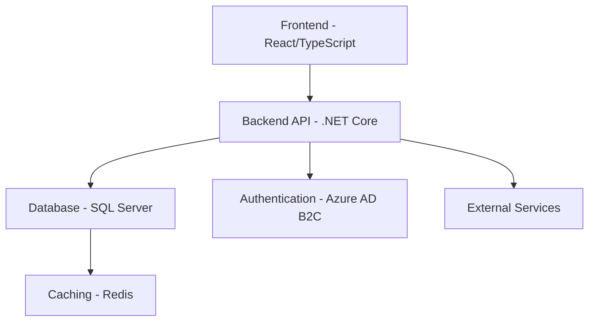

# KitchenPantry: Product Context and System Patterns Document

## Introduction

This document provides a comprehensive overview of the KitchenPantry CRM (Customer Relationship Management) system, detailing its purpose, architecture, and the strategic patterns employed in its design. Our goal is to create a clear, accessible guide that helps stakeholders understand the system's core principles, components, and design philosophy.

## Product Context

### Product Overview
KitchenPantry is a specialized Customer Relationship Management system tailored specifically for the food service industry. It aims to streamline relationship management between sales teams, organizations, contacts, and distributors in the food service ecosystem.

### Business Requirements
1. **Relationship Tracking**
   - Comprehensive management of customer interactions
   - Detailed tracking of organizational and contact information
   - Opportunity pipeline management

2. **Sales Efficiency**
   - Centralized data repository
   - Simplified interaction logging
   - Priority-based organization management

3. **Decision Support**
   - Detailed reporting and analytics
   - Performance tracking for sales teams
   - Opportunity progression insights

### Key Stakeholders
- **Primary Users**
  - Sales Representatives
  - Account Managers
  - Sales Managers

- **Supporting Stakeholders**
  - IT Department

### Core Use Cases
1. **Organization Management**
   - Create and update organizational profiles
   - Track distributor relationships
   - Assign priority levels
   - Manage contact information

2. **Interaction Tracking**
   - Log customer interactions
   - Schedule follow-ups
   - Document communication details
   - Update opportunity status

3. **Opportunity Management**
   - Create new sales opportunities
   - Track opportunity progression
   - Analyze win/loss ratios
   - Generate performance reports

## System Architecture

### High-Level Architecture Diagram

### Component Overview
1. **Frontend (React/TypeScript)**
   - Responsive user interface
   - State management
   - Client-side routing
   - Form handling and validation

2. **Backend API (.NET Core)**
   - RESTful endpoint implementation
   - Business logic processing
   - Data validation
   - Authentication and authorization

3. **Database (SQL Server)**
   - Persistent data storage
   - Complex query support
   - Transactional integrity

4. **Authentication (Azure AD B2C)**
   - User authentication
   - Role-based access control
   - Secure token management

### Data Flow
1. User interaction in frontend
2. API request to backend
3. Business logic processing
4. Database query/mutation
5. Response propagation
6. Frontend state update

## System Patterns

### Design Patterns
1. **Repository Pattern**
   - Abstracts data access logic
   - Provides consistent interface for data operations
   - Enables easier testing and maintenance

2. **Dependency Injection**
   - Loose coupling between components
   - Improved modularity
   - Simplified testing and configuration

3. **CQRS (Command Query Responsibility Segregation)**
   - Separate read and write operations
   - Optimized performance
   - Enhanced scalability

### Architecture Patterns
1. **Clean Architecture**
   - Separation of concerns
   - Domain-centric design
   - Independent of frameworks
   - Testability and maintainability

2. **Microservices-Ready Design**
   - Modular service boundaries
   - Independent deployability
   - Technology agnostic interfaces

### Coding Standards
1. **Naming Conventions**
   - PascalCase for types
   - camelCase for variables
   - Meaningful, descriptive names
   - Avoid abbreviations

2. **Error Handling**
   - Centralized error management
   - Detailed logging
   - User-friendly error messages
   - Predictable error responses

### Testing Strategies
1. **Unit Testing**
   - Isolated component testing
   - High code coverage
   - Test-Driven Development (TDD) approach

2. **Integration Testing**
   - Component interaction verification
   - Database integration tests
   - API endpoint testing

3. **End-to-End Testing**
   - Full workflow simulation
   - User journey validation
   - Performance testing

## Interoperability and Integration

### External Integrations
- Distributor management systems
- Payment gateways
- Email services
- Reporting and analytics platforms

### Internal Communication
- RESTful API communication
- Event-driven messaging
- WebSocket for real-time updates

### Error Handling
- Retry mechanisms
- Circuit breaker pattern
- Comprehensive logging
- Graceful degradation

## Future Considerations

### Scalability
- Horizontal scaling support
- Microservices architecture preparation
- Cloud-native design principles

### Extensibility
- Plugin architecture
- Modular feature development
- Open API specifications

### Maintenance Strategy
- Regular security audits
- Continuous integration
- Performance monitoring
- Technical debt management

## Conclusion

KitchenPantry represents a thoughtfully designed CRM solution that balances complexity with usability. By leveraging modern architectural patterns and best practices, we've created a system that is:

- Scalable
- Maintainable
- Adaptable to changing business needs
- Focused on delivering value to food service sales professionals

The architecture and patterns chosen reflect our commitment to creating a robust, flexible platform that can evolve with our users' requirements.

---

**Key Design Decisions:**
- Prioritized clean, modular architecture
- Implemented comprehensive testing strategies
- Designed with future extensibility in mind
- Focused on user experience and performance
