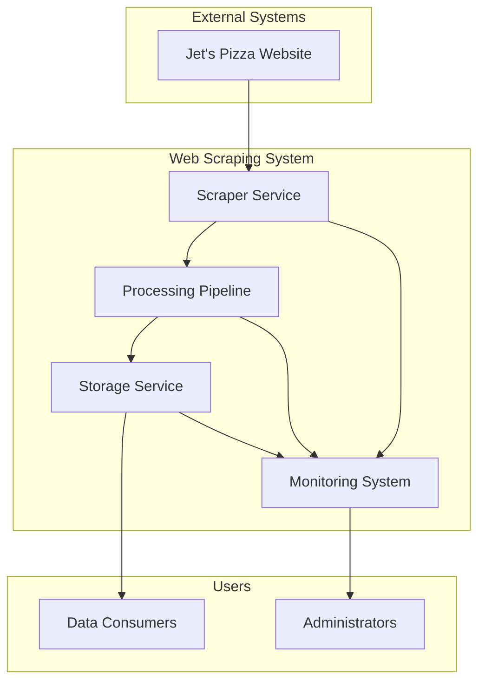
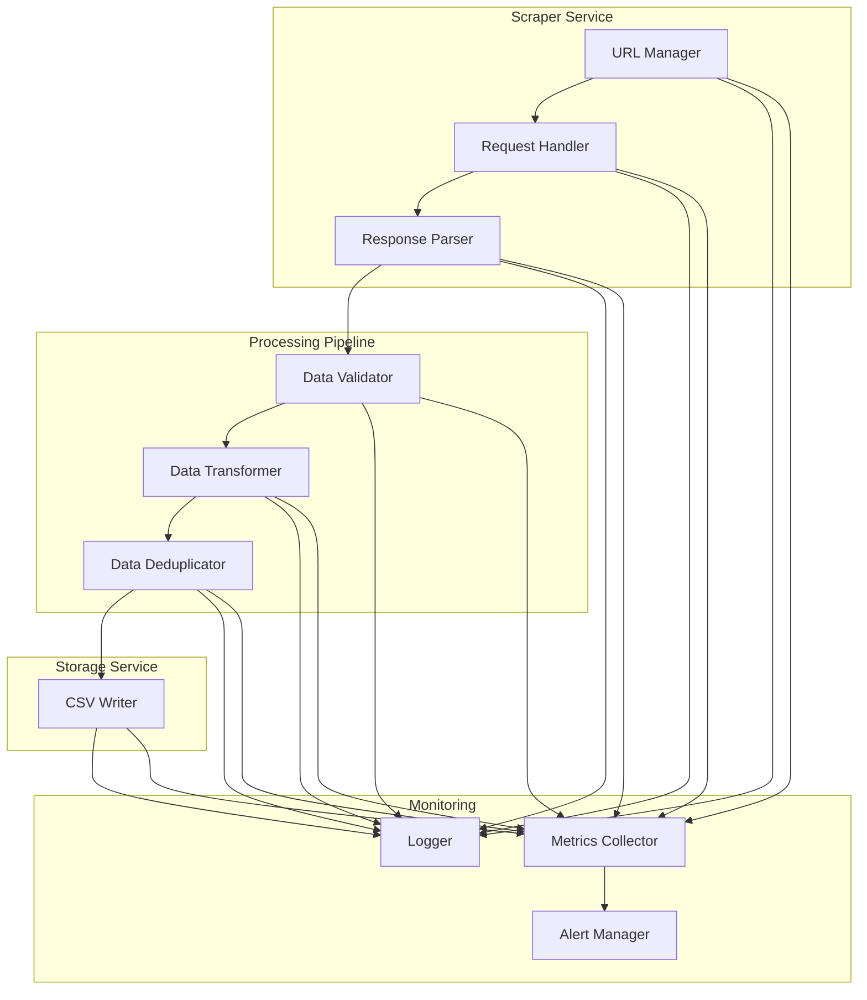
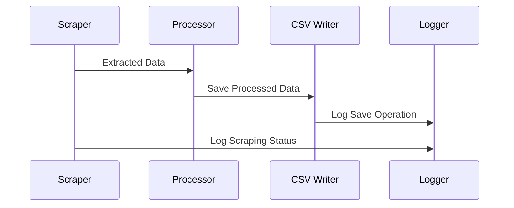
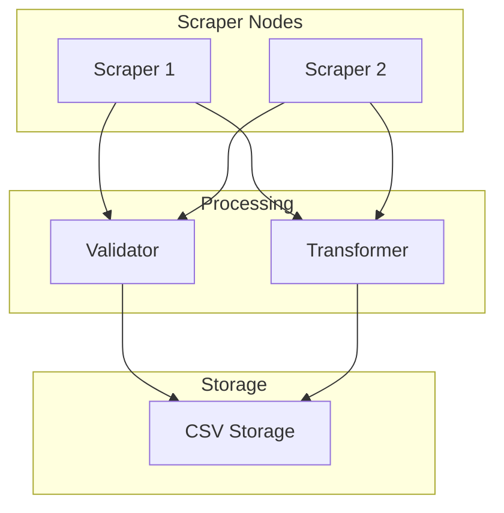
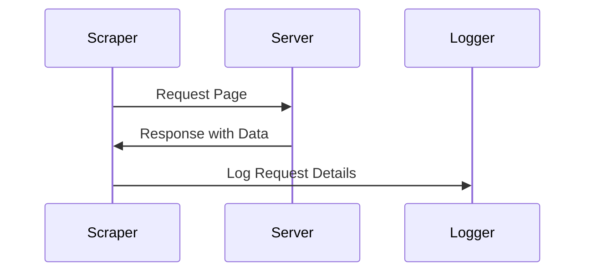
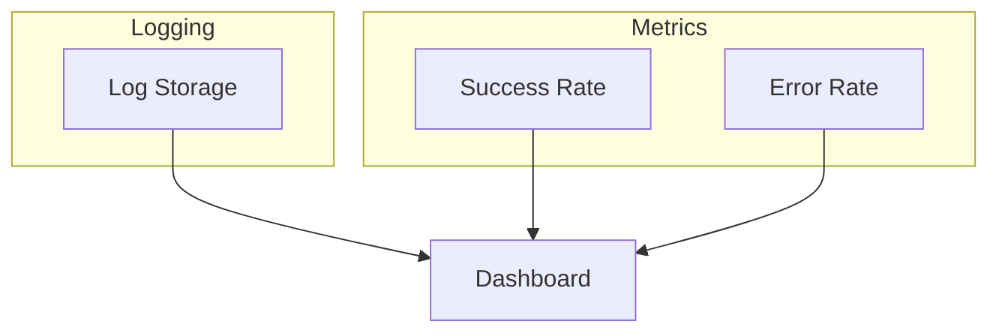
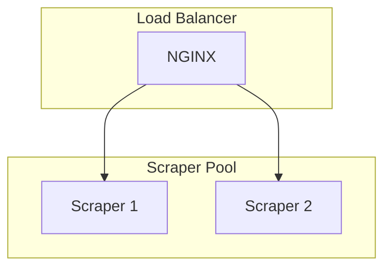
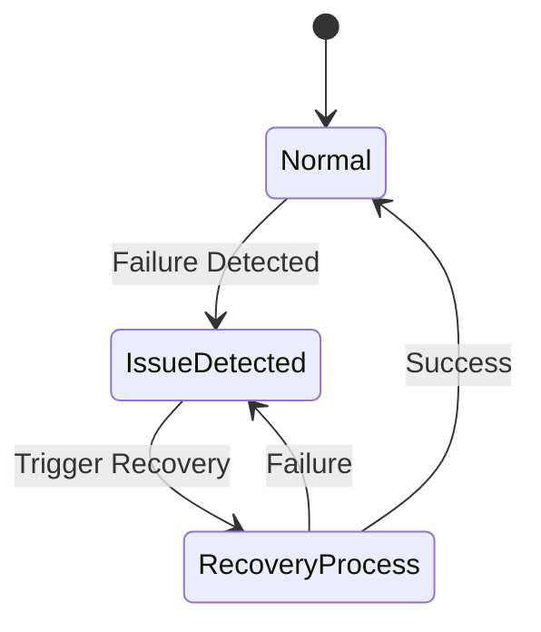

# **Web Scraping System Architecture Document**

## **1. System Overview**

### **1.1 Purpose**

The Web Scraping System is designed to extract store addresses from Jet’s Pizza’s website by iterating through each state’s store locator page. The system ensures efficient data retrieval, transformation, storage, and monitoring. The extracted data will be structured and saved in a CSV file for further analysis and business use.

### **1.2 System Context**



---

## **2. Architecture Principles**

### **2.1 Design Principles**

- **Modularity** – Each component (scraping, processing, storage) is separate.
- **Scalability** – Can handle increased data load by adding parallel scraping processes.
- **Reliability** – Includes error handling, retries, and monitoring to ensure consistency.
- **Maintainability** – Clear logging and structured code for easy debugging and updates.
- **Security** – Uses headers, rate limiting, and follows ethical scraping guidelines.

### **2.2 Architecture Decisions**

|Decision|Rationale|Alternatives Considered|
|---|---|---|
|Async Processing|Handle multiple requests efficiently|Synchronous processing|
|CSV Storage|Simple, structured storage for data|Database, JSON files|
|Logging & Alerts|Monitor failures for debugging|Manual log inspection|

---

## **3. System Components**

### **3.1 Component Architecture**



---

### **3.2 Component Details**

#### **3.2.1 Scraper Service**

```python
class ScraperService:
    def __init__(self):
        self.url_manager = URLManager()
        self.request_handler = RequestHandler()
        self.parser = ResponseParser()
        
    def scrape(self, url: str) -> dict:
        urls = self.url_manager.get_state_urls(url)
        responses = self.request_handler.fetch(urls)
        return self.parser.parse(responses)
```

#### **3.2.2 Processing Pipeline**

```python
class ProcessingPipeline:
    def __init__(self):
        self.validator = DataValidator()
        self.transformer = DataTransformer()
        self.deduplicator = DataDeduplicator()
    
    def process(self, data: dict) -> dict:
        validated = self.validator.validate(data)
        transformed = self.transformer.transform(validated)
        return self.deduplicator.remove_duplicates(transformed)
```

---

## **4. Data Architecture**

### **4.1 Data Flow**



### **4.2 Data Models**

```python
@dataclass
class ScrapedData:
    state: str
    store_address: str
    timestamp: datetime
```

---

## **5. Technology Stack**

### **5.1 Core Technologies**

|Component|Technology|Purpose|
|---|---|---|
|Scraping|`requests`, `BeautifulSoup`|Extracting HTML data|
|Processing|`pandas`|Data cleaning & structuring|
|Storage|`CSV`|Storing structured data|
|Monitoring|`logging`|Tracking system health|

### **5.2 Infrastructure**



---

## **6. Security Architecture**

### **6.1 Security Measures**

- **Rate Limiting** – Ensures ethical scraping.
- **Header Spoofing** – Mimics browser behavior.
- **Data Validation** – Prevents malformed input storage.

### **6.2 Security Flow**



---

## **7. Monitoring Architecture**

### **7.1 Monitoring Components**



### **7.2 Key Metrics**

|Metric|Type|Threshold|Action|
|---|---|---|---|
|Success Rate|Ratio|>90%|No Action|
|Error Rate|Ratio|>10%|Alert|
|Response Time|Gauge|>2s|Optimize|

---

## **8. Scaling Strategy**

### **8.1 Horizontal Scaling**



### **8.2 Scaling Triggers**

- **CPU Utilization > 70%** – Add more scraper instances.
- **Queue Length > 1000** – Increase processing power.

---

## **9. Disaster Recovery**

### **9.1 Backup Strategy**

- **Data Backups:** Weekly CSV storage backups.
- **Log Retention:** 30-day rolling logs for issue tracking.

### **9.2 Recovery Procedures**


